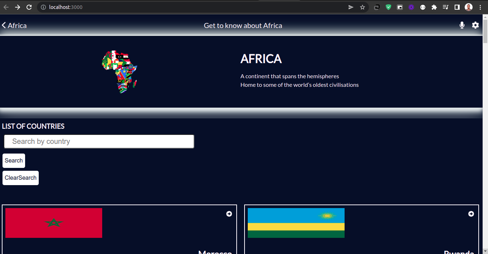
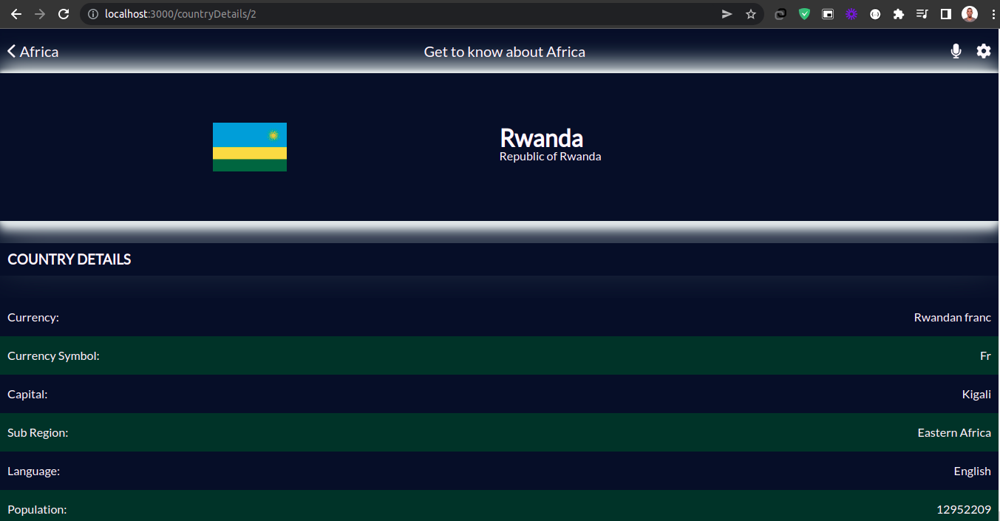
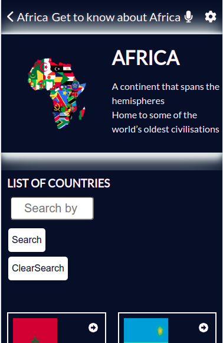
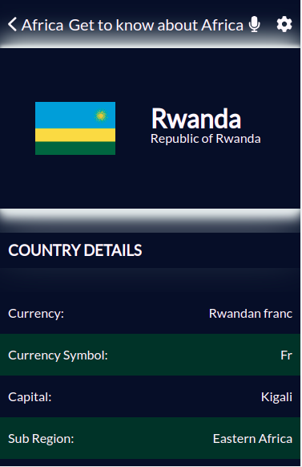

# Metrics App for African countries

> This project is about an app that displays the total number of countries in the African continent. It also displays the key metrics of each country, like the population, the languages spoken, the driving side, and the capital, and many more.

## Built With:

- Html5
- CSS3
- Javascript
- React
- Redux
- ES6

## Screenshots

### Desktop version homepage


### Desktop version details page


### Phone version homepage


### Phone version details page



## Live Demo

- [Live link](https://african-countries.herokuapp.com/).

## Video Presentation

- [Click Here](https://www.loom.com/share/836f520eef724bdd8f9a4aef48c5c548)

## Getting Started

To get a copyof this project you can follow these simple steps.

- run npm install

## Prerequisites

- browser (e.g. Google Chrome)
- text editor (e.g. VSCode)
- terminal/CLI

### Installation

- Copy these

  ```sh
  git clone https://github.com/Pazzo97/metrics-webapp.git

  ```

- then

  ```sh
  cd metrics-webapp

  ```

- open with vs code and run with live server.
- Install NPM packages
  ```sh
  npm install
  ```

### Testing

- Run
  ```sh
  npm test
  ```

## Author

👤 **Author**

- GitHub: [@Pazzo97](https://github.com/Pazzo97)
- LinkedIn: [@LinkedIn](https://www.linkedin.com/in/patrick-mukunzi-8389861a9/)
- Twitter: [@mukunzipat](https://twitter.com/mukunzipat)


## 🤝 Contributing

Contributions, issues, and feature requests are welcome!

Contributions are what make the open source community such an amazing place to learn, inspire, and create. Any contributions you make are **greatly appreciated**.

If you have a suggestion that would make this better, please fork the repo and create a pull request. You can also simply open an issue with the tag "enhancement".
Don't forget to give the project a star! Thanks again!

1. Fork the Project
2. Create your Feature Branch (`git checkout -b feature/AmazingFeature`)
3. Commit your Changes (`git commit -m 'Add some AmazingFeature'`)
4. Push to the Branch (`git push origin feature/AmazingFeature`)
5. Open a Pull Request

Feel free to check the [issues page](https://github.com/Pazzo97/metrics-webapp/issues).

## Show your support

Give a ⭐️ if you like this project!

## Acknowledgments

- [REST Countries](https://restcountries.com/v3.1/all) - for the API I used for dispalying the countries and each and everyone details.

- [Nelson Sakwa](https://www.behance.net/gallery/31579789/Ballhead-App-(Free-PSDs)) for the Design of the project.

## 📝 License

This project is [MIT](LICENSE) licensed.
